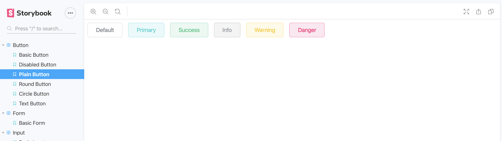

# hakawati
This is a collection of reusable UI components built in [Vue](https://vuejs.org/) based on our design system. Our UI components are based on [ElementUI](https://element.eleme.io/#/en-US), a desktop-focused UI library.
<br/>
<p align="center">
  
</p>

## Setup
```
yarn install
```

#### Compiles and hot-reloads for development
```
yarn serve
```

#### Compiles and minifies for production
```
yarn build
```

#### Run your unit tests
```
yarn test:unit
```

#### Lints and fixes files
```
yarn lint
```

#### Run storybook
```
yarn storybook
```
